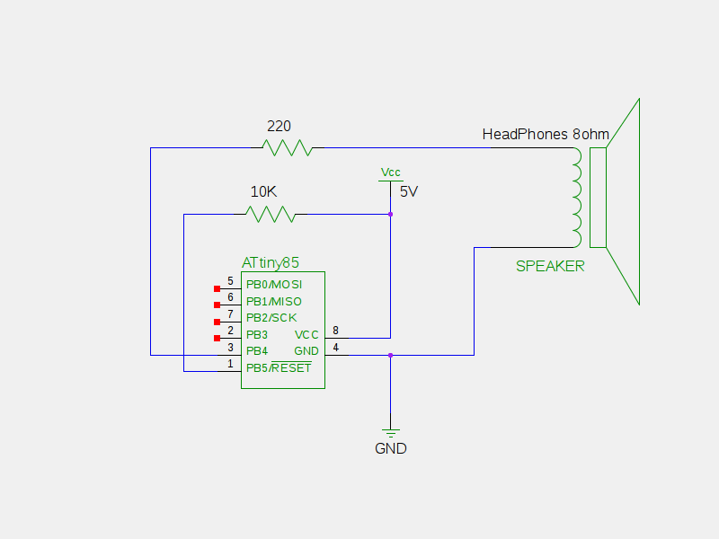

Hardware Circuit Setup
===

The hardware configurations for this chip are quite simple.

Basic Headphone Output
---

This layout works, but I do not recommend it very highly.

The only additional components are a 10k resistor pulling up the reset pin and a 220 ohm resistor limiting current to the speaker. The reset pull up seems to be practically optional, if you are feeling lazy or just want to make sure it works.

Basic Output with LowPass filter
---

This adds an RC LowPass filter as well as an electrolytic capacitor (value doesn't matter much) to eliminate any DC current to the output. I recommend something along these lines. Especially if you wish to run the output into powered speakers or an amplifier. An additional potentiometer can be added at the output point (before the speakers) for volume control, of course.

The resistor and capacitor values can be fudged quite a bit, but the example values will have a roll-off around 16KHz which is nicely in the human audible range, and happens to match the components I had laying around. If you have different capacitors and resistors, they can be used for a filter in the 1 - 20KHz range. There is a convenient online RC Filter calculator [here](http://www.ekswai.com/en_lowpass.htm).

